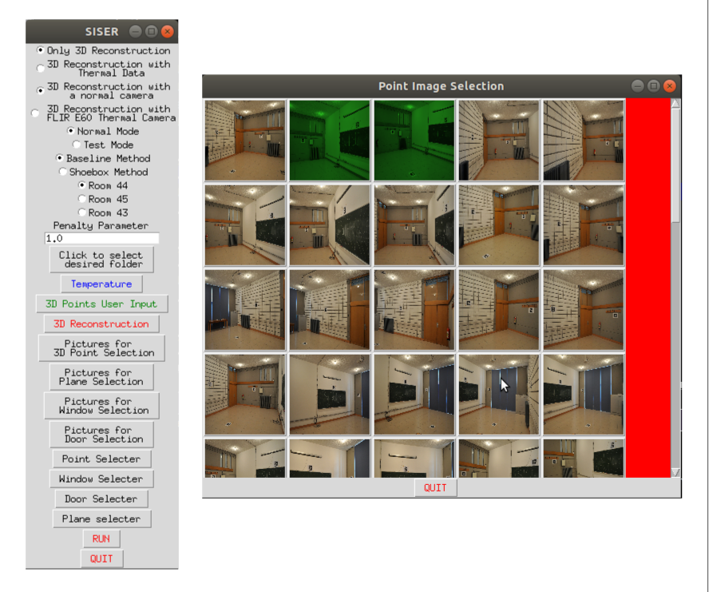

# SISER Thermal3D!

The purpose of this tool is to reconstruct the 3D models of the indoor spaces of buildings and register the produced 3D model with the thermal images of the same indoor space is they are available. A simple GUI is provided for that purpose. The input of the program could be either just an image sequence or two sequences of normal images and thermal images taken with the same thermal camera. In case of both normal and thermal images, the images should be taken by mounting the normal and thermal cameras on a rigid body, both normal and thermal images should be taken at the same time and the number of normal and thermal images should be the same, since our system assumes that the rigid body transformation between each pair of normal and thermal image is constant and this assumption is exploit for the rest of the calculations.  The final result is two different files containing the 3D models of the corresponding room. One of them is ann ".off" file and the other is an ".xml" file. Both of these files contain the 3D model consists of 6 wall of a room, the windows and doors of the room. Only difference of the ".xml" file is it also contains the thermal resistance values for each wall denoted as "R" in the ".xml" file. For detalied information about the algorithm working in this software, you may check the publication [1].

# Dependencies

Our software utilizes [COLMAP](https://colmap.github.io/) for 3D reconstruction, so that COLMAP should be installed by following the instructions on [official installation page of COLMAP](https://colmap.github.io/install.html). The other dependencies of our software are as follows: \
 
- Python 3.6 or higher
- numpy
- opencv-contrib-python == 4.1.2 or higher 
- pillow
- pandas
- scipy
- shutil
- pytemperature

You may install these dependencies by running \
`pip install -r requirements.txt`

# Options
In the beginning, there are some choices about the function of the software. They are as follows:

##  Thermal or Only 3D Reconstruction
The first choice is for selecting whether only 3D reconstruction or 3D reconstion with thermal image registration is performed.

## Normal or Test Mode
In this part, the user selects normal or test mode, which normal mode only computes the resultant 3D model for once. On the other hand, test mode computes the 3D model for 100 times computes volume and vertex error and calculates the mean and standard deviation of these errors.

## Baseline or Shoebox
Baseline and shoebox are two different methods for computing 3D model. The baseline method tries to fit a plane using the 3D points whose projection lies in the selected rectangle boxes for each wall. The shoebox method does the same with one difference, it forces the computed planes to be orthogonal. Therefore, the resultant 3D room models consist of only orthogonal walls. 

## Room Selection
For different rooms the walls containing windows or doors are different. Hence, for the room whose 3D model to be computed should be selected.

## Penalty Parameter
If shoebox method is selected, the loss defining the orthogonality is added to the total loss with a parameter. In this section, that parameter can be adjusted. In our experiments, we observed that a penalty parameter of 1.0 works best, so the default value is 1.0 

# Flow of the Software
The software can be used to by clicking the all buttons from top to bottom in order. 

## Folder Selection
First the user selects the workspace folder, normal image folder and thermal image folder (optional) by clicking `Click to select desired folder` button. 

## Temperature
This button should be used if thermal images are available. The inside, outside, reflected temperature information is asked to the user for thermal resistance calculation.

## 3D Points User Input
If the software runs for the first for a specific image set. The user should enter the coordinates of the 4 3D points to be used for scaling operation since COLMAP produces 3D points clouds with an unknown scale. In the upcoming parts user also selects these 3D points projected 2D points on at least 2 different images. 

## 3D Reconstruction
In the first time of running with an image sequence, a 3D point cloud should be computed with COLMAP by clicking this button.

## Pictures for ... Selection
Since the functions of `Pictures for 3D Point Selection`, `Pictures for Plane Selection`, `Pictures for Window Selection` and `Pictures for Door Selection` buttons are similar they are groupped in the same section. After hitting each of these buttons a list of available normal images appears in which user has to select some of them for the related task. For "3D Point Selection", at least two images where the previously defined 4 3D points' projection exist which has to clicked in the first run of the software with an image sequence. It is not necessary if this operation has done once since the resulting transformation file is saved in the workspace for future use.  For "Plane" 6 images has to be selected to used for defining the 6 walls of a room. For "Window" and "Door" buttons the image to select windows or doors should be selected. One image has to be selected for one window or door. 

## ... Selecter
`Point Selecter`, `Window Selecter`, `Door Selecter`, and `Plane Selecter` buttons are grouped under this section since they function similarly. `Point Selecter` shows the pictures selected by the `Pictures for 3D Point Selection` and used in the run similar to that button. User has to select 4 points on each of these images for scaling operation. `Window Selecter` and `Door Selecter` shows the images contaning windows and doors. The user has to select the 4 corners of each window and door. `Plane Selector` show the images corresponding to the 6 walls of a room. User select the a planar region on each of those walls by clicking twice. The two clicks corresponds to the two distant corners of a rectangle and the rectangle is defined after two clicks. In all these, buttons after neccessary selections are made, user may go to the next image by clicking `q`. After the last image `q` terminates the corresponding section. 

## Run
After every selection is performed, click `RUN` button to run the software to produce the resultant 3D model.  

# Publications
[1]  Dino IG, Sari AE, Iseri OK, Akin S, Kalfaoglu E, Erdogan B, Kalkan S, Alatan AA. Image-based construction of building energy models using computer vision. Automation in Construction. 2020 Aug 1;116:103231.
